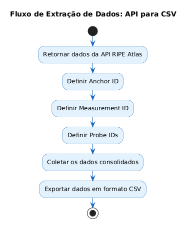
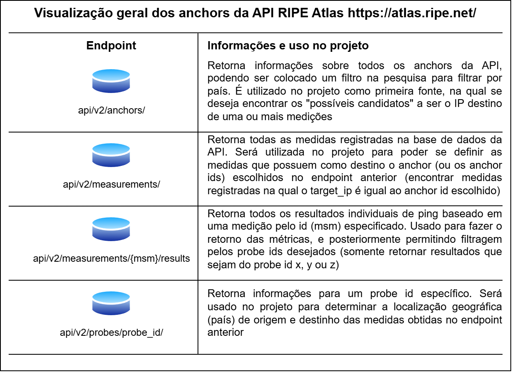

## Fluxo da coleta de dados
Esse diagrama mostra de uma forma simplificada a etapa de coleta baseada na formação de pares de fluxos de testes

## Endpoints da API 
Esse diagrama demonstra de uma maneira geral todos os endpoints que estão sendo usados na etapa de coleta de dados e qual o uso de cada um no projeto

