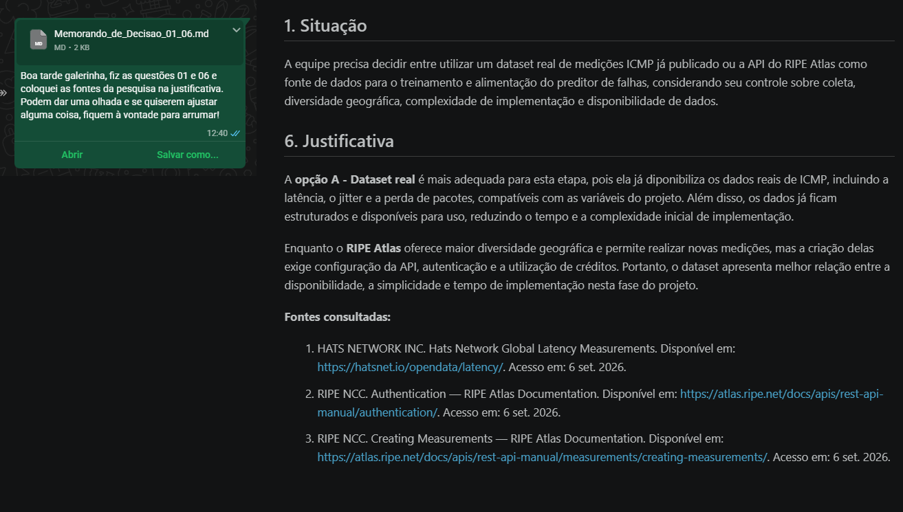
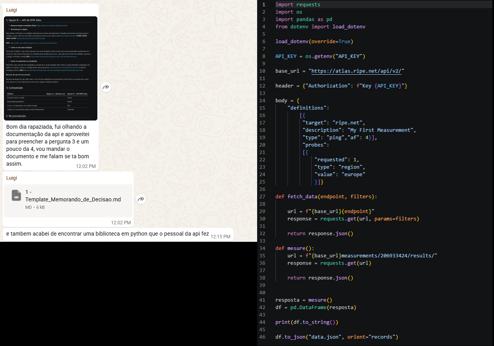
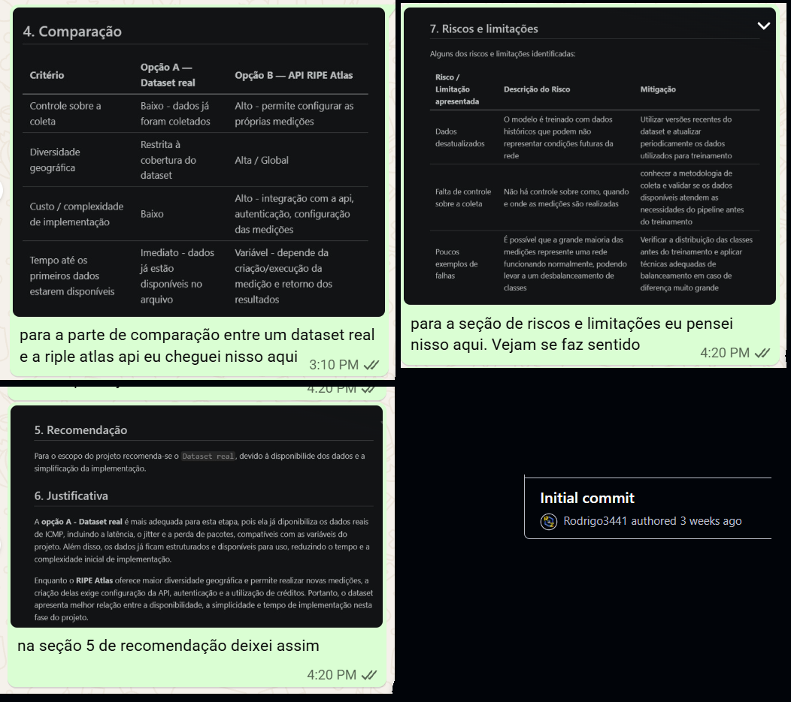

# Memorando de Decisão — Fonte de Dados do Projeto


| Campo | Informação |
|---|---|
| Curso / Disciplina | `Ciência da Computação / Estrutura de Dados II` |
| Projeto integrador | `Estrutura de Dados II`<br> `Redes de Computadores`<br> `Análise e Projeto de Sistemas` |
| Orientador(a) | `Professora Andrea Ono Sakai` |
| Data de entrega desta etapa | `08/09/2026` |
| Integrantes do grupo | `Eduardo Gabriel de Souza Cardozo`<br> `Gabriel Alves de Farias`<br> `Gisele Franco de Lima`<br> `Luigi Santos Caires`<br> `Rodrigo de Souza Galvão` |

---

> Preencha cada seção com o que você encontrou na pesquisa. Não deixe nenhum campo com o texto entre colchetes — substitua pelo seu conteúdo. Toda informação levantada nas Opções A e B precisa indicar a fonte de onde veio.

## 1. Situação

<!-- Em uma frase: qual decisão precisa ser tomada e por quê. 
O pipeline do projeto já está definido: qualquer fonte de dados precisa produzir registros que se transformem em janelas e, por fim, em X = [latência, perda, jitter]. Falta decidir de onde virão esses dados na próxima fase. A equipe do projeto precisa recomendar, com base em pesquisa e não em preferência pessoal, se a próxima etapa deve usar um dataset real já publicado ou a API do RIPE Atlas. O grupo deve produzir um memorando de decisão com a recomendação da tomada de decisão. A recomendação só tem valor se for sustentada por pesquisa real — não existe resposta pronta para copiar; ela precisa ser construída a partir do que vocês encontraram.
-->

A equipe precisa decidir entre utilizar um dataset real de medições ICMP já publicado ou a API do RIPE Atlas como fonte de dados para o treinamento e alimentação do preditor de falhas, considerando seu controle sobre coleta, diversidade geográfica, complexidade de implementação e disponibilidade de dados.

## 2. Opção A — Dataset real

<!-- O que foi encontrado sobre um dataset real de ICMP. Cite a fonte de cada informação. -->

- **Origem / link:** [Hats Network — Global Latency Measurements](https://hatsnet.io/opendata/latency/)
- **Formato:** CSV, JSON e YAML. O dataset disponibiliza tanto séries de pings individuais quanto estatísticas agregadas.
- **Período coberto:** O dataset possui versões diárias; a versão consultada é de 08/08/2026. Novas versões são publicadas diariamente quando há novas medições.
- **Campos disponíveis:** Nos registros individuais: from, to, round_id, seq, offset_ms e rtt_ms. Também existem estatísticas agregadas como rtt_avg, rtt_min, rtt_max, rtt_stdev, jitter_ms e packet_loss_percent.
- **Licença de uso:** CC BY 4.0 (Creative Commons Attribution 4.0 International). Permite compartilhar e adaptar os dados, desde que seja dado o devido crédito.

**Resumo do que foi encontrado:**

O Hats Network Global Latency Measurements é um dataset público produzido a partir de medições reais de ICMP Echo na rede de produção da Hats Network. Cada par de pontos de presença (PoP) é medido com 50 requisições ICMP, enviadas em intervalos de 100 ms. Os resultados são disponibilizados tanto individualmente, com o RTT de cada pacote, quanto de forma agregada. O dataset também fornece estatísticas de latência, jitter e perda de pacotes. A estrutura dos dados é adequada para o projeto porque permite trabalhar com vários registros temporais de uma mesma rodada e posteriormente agrupá-los em janelas.

## 3. Opção B — API do RIPE Atlas

<!-- O que foi encontrado sobre a API: autenticação, criação e consulta de medições. Cite a fonte de cada informação. -->

- **Documentação consultada (links):** <br>
    - [REST API Manual](https://atlas.ripe.net/docs/getting-started/)<br>
    - [Autenticação](https://atlas.ripe.net/docs/apis/rest-api-manual/authentication/)<br>
    - [Chave API](https://atlas.ripe.net/docs/apis/rest-api-manual/authentication/api-keys/)
    - [Criando Medidas](https://atlas.ripe.net/docs/apis/rest-api-manual/measurements/creating-measurements/)<br>
    - [Definição das Medidas](https://atlas.ripe.net/docs/apis/rest-api-manual/measurements/creating-measurements/definitions/)<br>
    - [Seleção de Probes](https://atlas.ripe.net/docs/apis/rest-api-manual/measurements/creating-measurements/probe-selection)<br>
    - [Resultados](https://atlas.ripe.net/docs/apis/rest-api-manual/measurements/results-and-latest)<br>
    - [Créditos](https://atlas.ripe.net/docs/getting-started/credits/)


- **Autenticação exigida:** De acordo com a documentação, grande parte das operações de consulta da API, incluindo o acesso a medições públicas, não precisa de uma chave de API. Entretanto, para criar medições próprias, é necessário utilizar uma chave com as permissões adequadas.

    Para obter uma chave, é necessário possuir uma conta no RIPE NCC Access e realizar sua configuração na área de chaves de API do RIPE Atlas. A chave deve ser mantida em segurança, pois permite realizar operações autorizadas em nome da conta.

- **Configurando chaves:** A chave de API deve ser enviada no cabeçalho da requisição HTTP utilizando o esquema Key. O formato esperado é:

    ``` bash
    Authorization: Key SUA_CHAVE
    ```

    Dessa forma, a chave não precisa ser inserida diretamente na URL da requisição. As permissões associadas à chave determinam quais operações autenticadas podem ser realizadas.

- **Como se cria uma medição e define métricas:** Para criar uma medição própria, deve-se realizar uma requisição HTTP do tipo POST para o endpoint:

    ``` bash
    https://atlas.ripe.net/api/v2/measurements/
    ```

    A requisição deve conter um corpo em formato JSON com as configurações da medição. Entre os principais elementos estão:

    definitions: especifica o que será medido;<br>
    probes: especifica de quais probes a medição será realizada.

    Na definição da medição, alguns parâmetros importantes são:

    description: descrição da medição;<br>
    type: tipo de medição, sendo utilizado neste projeto o tipo ping;<br>
    target: endereço IP ou destino que será medido;<br>
    af: família de endereços utilizada, sendo 4 para IPv4 e 6 para IPv6.

    No caso do tipo ping, a medição utiliza requisições ICMP para obter informações como tempo de resposta. A seleção das probes é importante porque determina a origem das medições e pode ser configurada por critérios como país, região, ASN ou probes específicas.

    Após a criação, a API retorna um identificador da medição, que será utilizado para consultar seus resultados.

- **Como se consultam os resultados:** Para consultar os Para consultar os resultados de uma medição, é necessário possuir seu ID e realizar uma requisição HTTP do tipo GET para o endpoint:

    `https://atlas.ripe.net/api/v2/measurements/{ID_DA_MEDIÇÃO}/results/`

    Em Python, essa consulta pode ser realizada utilizando a biblioteca requests. O ID da medição deve ser inserido na própria URL para que a API retorne os dados correspondentes à medição selecionada.

    Os resultados obtidos poderão ser processados pelo projeto para extrair ou organizar informações relacionadas à latência, perda de pacotes e jitter. Posteriormente, esses dados poderão ser agrupados em janelas temporais para formar as entradas do preditor, representadas por:

    X = [latência, perda, jitter]

- **Créditos para criação de medidas:** O RIPE Atlas utiliza um sistema de créditos relacionado à realização de medições criadas pelos usuários. O consumo de créditos depende da configuração da medição e da quantidade de resultados produzidos.

    Dessa forma, o custo não está necessariamente relacionado apenas ao envio da requisição HTTP, mas à execução da medição e aos recursos utilizados. Fatores como o tipo de medição, a quantidade de probes, a periodicidade e a duração podem influenciar o consumo.

    Por esse motivo, antes de criar medições próprias para o projeto, será necessário verificar a disponibilidade de créditos da conta e escolher uma configuração compatível com o objetivo da coleta.

- **Resumo do que foi encontrado:**

    A documentação do RIPE Atlas apresenta os procedimentos necessários para utilizar sua API REST, incluindo autenticação, criação de chaves, criação de medições por meio de requisições POST e consulta de resultados por meio de requisições GET.

    Também foi identificado que a criação de uma medição envolve tanto a definição do que será medido, por meio de definitions, quanto a seleção das probes responsáveis pela coleta. Os resultados obtidos pela API podem servir como fonte para a construção de uma base temporal contendo latência, perda de pacotes e jitter, que posteriormente poderá ser utilizada na formação das entradas do preditor.

## 4. Comparação

<!-- Preencha a tabela com base no que você levantou nas seções 2 e 3. -->

| Critério | Opção A — Dataset real | Opção B — API RIPE Atlas |
|----------|------------------------|--------------------------|
| Controle sobre a coleta | **Baixo** - dados já foram coletados|                   **Alto** - permite configurar as próprias medições |
| Diversidade geográfica |  **Restrita** à cobertura do dataset | **Alta / Global**|
| Custo / complexidade de implementação | **Baixo** | **Alto** - integração com a API, autenticação, configuração das medições |
| Tempo até os primeiros dados estarem disponíveis | **Imediato** - dados já estão disponíveis no arquivo | **Variável** - depende da criação/execução da medição e retorno dos resultados|

## 5. Recomendação

<!-- Uma frase direta: qual opção você recomenda. -->

Para o escopo do projeto recomenda-se a utilização da `RIPE Atlas API`, devido à flexibilidade dos dados e à possibilidade de criação de medidas personalizadas.

## 6. Justificativa

<!-- Por que essa opção vence a outra, com base nas evidências das seções 2, 3 e 4 — não em preferência pessoal. -->

A **opção A - Dataset real** é mais adequada para esta etapa, pois ela já disponibiliza os dados reais de ICMP, incluindo a latência, o jitter e a perda de pacotes, compatíveis com as variáveis do projeto. Além disso, os dados já ficam estruturados e disponíveis para uso, reduzindo o tempo e a complexidade inicial de implementação.

Enquanto o **RIPE Atlas** oferece maior diversidade geográfica e permite realizar novas medições, a criação delas exige configuração da API, autenticação e a utilização de créditos. Portanto, o dataset apresenta melhor relação entre a disponibilidade, a simplicidade e o tempo de implementação nesta fase do projeto.

## 7. Riscos e limitações

<!-- O que pode dar errado com a opção escolhida, e como isso poderia ser mitigado. -->
Alguns dos riscos e limitações identificados em relação ao `Dataset real`:

| Risco / Limitação apresentada | Descrição do Risco | Mitigação |
|-------------------|--------------------|-----------|
| Dados desatualizados | O modelo é treinado com dados históricos que podem não representar condições futuras da rede| Utilizar versões recentes do dataset e atualizar periodicamente os dados utilizados para treinamento |
| Falta de controle sobre a coleta | Não há controle sobre como, quando e onde as medições são realizadas | Conhecer a metodologia de coleta e validar se os dados disponíveis atendem às necessidades do pipeline antes do treinamento |
| Poucos exemplos de falhas | É possível que a grande maioria das medições represente uma rede funcionando normalmente, podendo levar a um desbalanceamento de classes | Verificar a distribuição das classes antes do treinamento e aplicar técnicas adequadas de balanceamento em caso de diferença muito grande | 


## 8. Contribuição Individual dos Integrantes

<!-- cada integrante deve descrever, com suas próprias palavras, o que efetivamente fez nesta etapa. Contribuições genéricas como "ajudei em tudo" não serão aceitas. Use verbos de ação e seja específico (ex.: "pesquisei , analisei, testei, ... apresentei prós/contras ao grupo, ...").-->

### Integrante 1 — `Eduardo Gabriel de Souza Cardozo`
- **O que fez nesta etapa:** `Pesquisei e resumi as informações para a seção 2.A - dataset real. Estava entre algumas opções para escolher, entre elas estava o Zenodo que tinha produzido dados reais a partir de uma operadora brasileira, porém, optei pelo Hats Network Global Latency Measurements pois ele afirmava explicitamente que usava dados reais a partir de medições ICMP Echo.`
- **Tempo dedicado (aprox.):** `1h30`
- **Evidência da contribuição** *(print de conversa, rascunho, e-mail, documento compartilhado etc.)*:


### Integrante 2 — `Gabriel Alves de Farias`
- **O que fez nesta etapa:** `Minha contribuição foi na revisão do trabalho, corrigindo erros de ortografia e propondo ajustes visuais para melhorar a compreensão do conteúdo e garantir maior alinhamento com os critérios exigidos.`
- **Tempo dedicado (aprox.):** `1h30`
- **Evidência da contribuição** *(print de conversa, rascunho, e-mail, documento compartilhado etc.)*:


### Integrante 3 — `Gisele Franco de Lima`
- **O que fez nesta etapa:** `Pesquisei as características do dataset real e da API do RIPE Atlas, analisei as vantagens e limitações de cada opção e elaborei a justificativa para a escolha do dataset real como fonte de dados do projeto.`
- **Tempo dedicado (aprox.):** `1h30`
- **Evidência da contribuição** *(print de conversa, rascunho, e-mail, documento compartilhado etc.)*: 

- `As imagens comprovam a minha contribuição, mostrando o envio do arquivo ao grupo e o conteúdo elaborado nas questões 01 e 06, incluindo a pesquisa e as fontes utilizadas.`




### Integrante 4 — `Luigi Santos Caires`
- **O que fez nesta etapa:** `Ajudei na pesquisa de como utilizar a API vendo a documentação da API REST do RIPE Atlas e como utilizá-la, além de seus pontos fortes e fracos.`
- **Tempo dedicado (aprox.):** `1h30`
- **Evidência da contribuição** *(print de conversa, rascunho, e-mail, documento compartilhado etc.)*: 


### Integrante 5 — `Rodrigo de Souza Galvão`
- **O que fez nesta etapa:** `Criei o repositório do GitHub, revisei o arquivo e todas as suas seções, fiz alguns ajustes e adequações nos textos, e preenchi algumas seções.`
- **Tempo dedicado (aprox.):** `1h30`
- **Evidência da contribuição** *(print de conversa, rascunho, e-mail, documento compartilhado etc.)*: 


---

## Fontes consultadas

<!-- Mínimo de 3 fontes. Liste todas as páginas de documentação, artigos ou repositórios usados. -->

1. HATS NETWORK INC. Hats Network Global Latency Measurements. Disponível em: https://hatsnet.io/opendata/latency/. Acesso em: 6 set. 2026.

2. RIPE NCC. Authentication — RIPE Atlas Documentation. Disponível em: https://atlas.ripe.net/docs/apis/rest-api-manual/authentication/. Acesso em: 6 set. 2026.

3. RIPE NCC. Creating Measurements — RIPE Atlas Documentation. Disponível em: https://atlas.ripe.net/docs/apis/rest-api-manual/measurements/creating-measurements/. Acesso em: 6 set. 2026.
